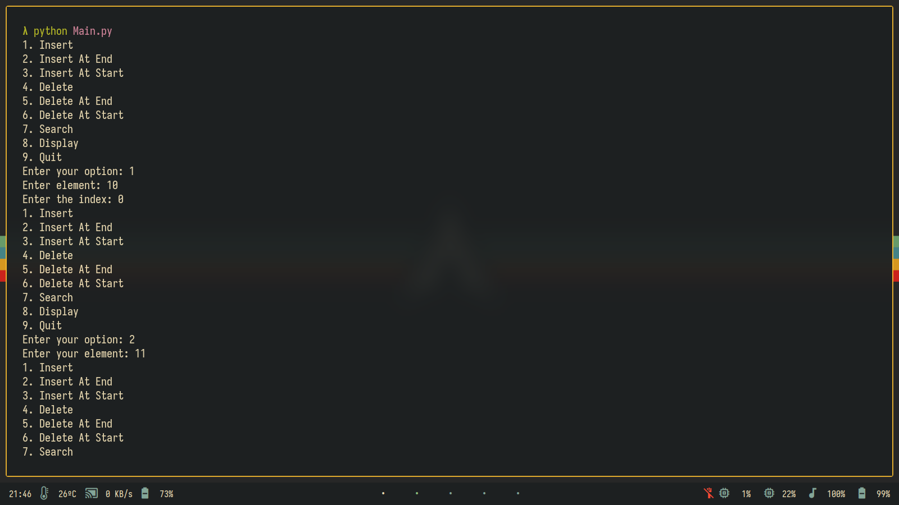
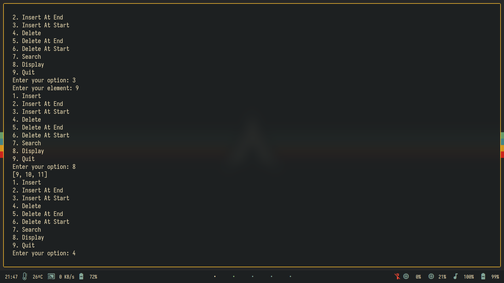
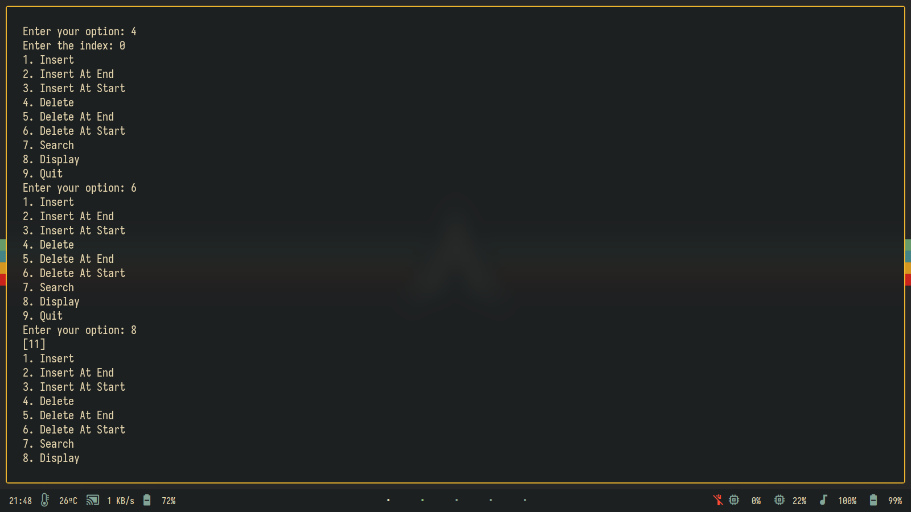
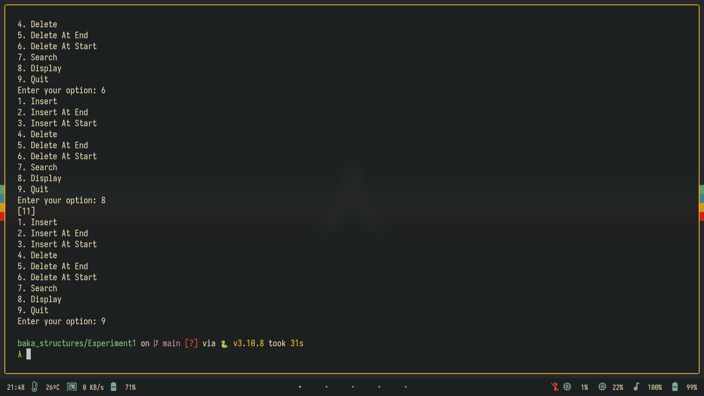

# baka_structures
baka_structures because it is stupid :P

## Note
I am not responsible if you get **caught cheating** with this repository
or this specific piece of code.

This is only for educational purposes and not for your tendency to cheat!!

# Output

## Experiment 1

